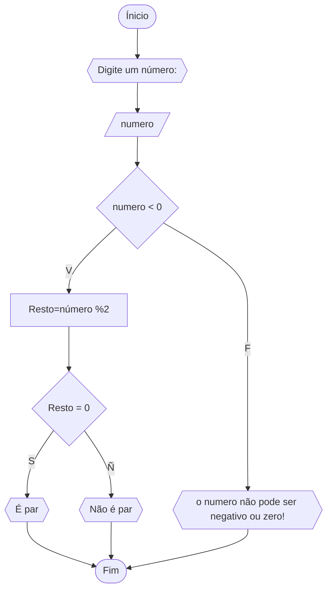

```
ALGORITMO verifica_par_impar
DECLARE numero, resto INTEIRO
ESCREVA "Digite um número:"
LEIA numero
SE numero > 0 ENTAO
     resto = numero% 
     SE resto == 0 ENTAO
     ESCREVA "O número é par!"
     SENAO 
     ESCREVA "O número é ímpar"
SENAO
    ESCREVA"O número deve ser positivo"
FIM

