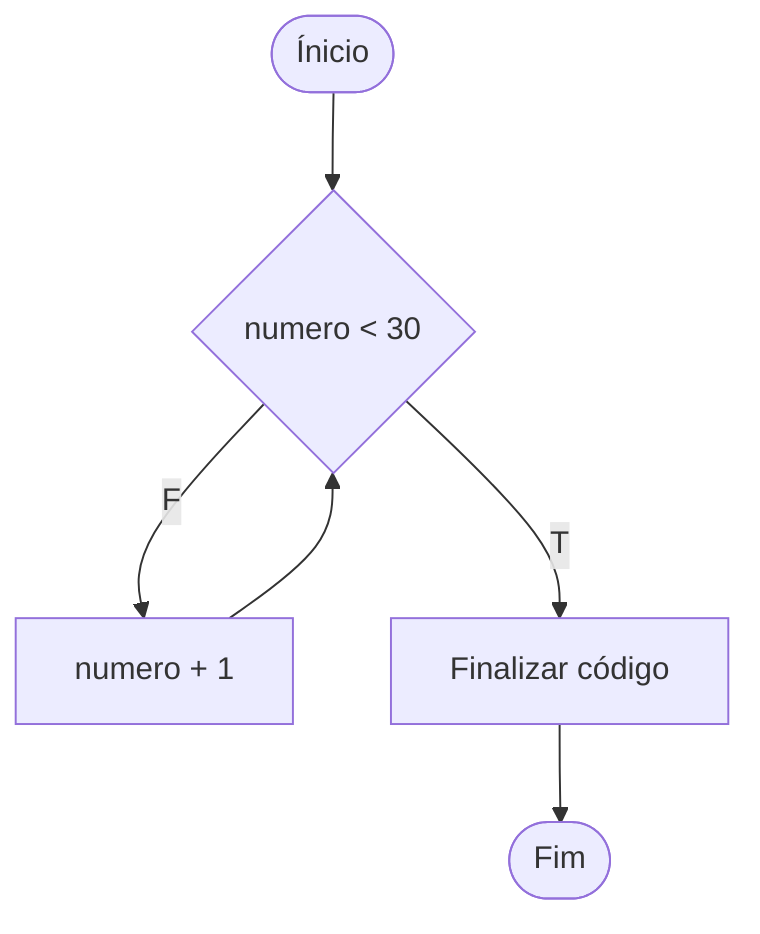

#Criar_algoritmo_para_contar_de_0_a_30

```mermaid

flowchart TD

 A([Ínicio])-->B{numero < 30}

B--F-->C[numero + 1]
C-->B
B--T-->D[Finalizar código]
D-->F([Fim])

```
```
ALGORITMO exiba_contagem_0_a_30
DECLARE numero, 
